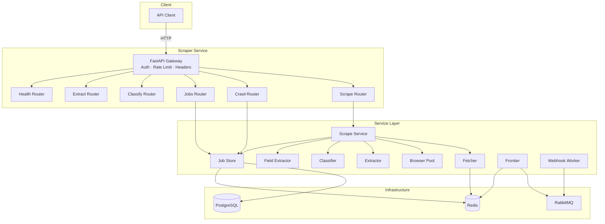
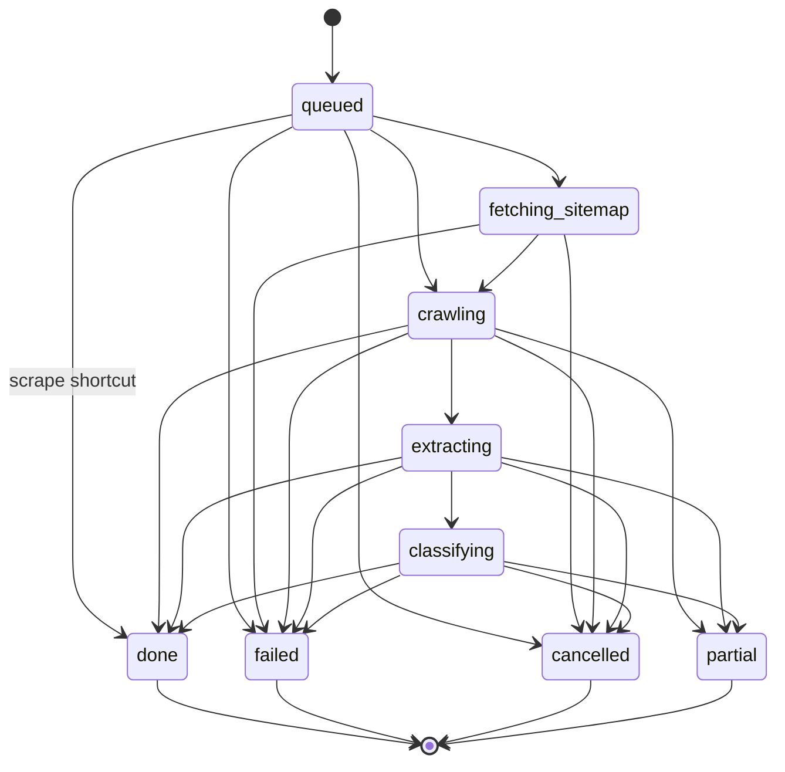

# Architecture

## System Overview

The Lex-Advisor Scraper Service is a high-performance, async Python microservice that fetches, extracts, classifies, and stores Romanian municipal documents.

## Component Responsibilities

| Component | Module | SRP Scope |
|---|---|---|
| **Scrape Service** | `app/services/scrape_service.py` | Orchestrates single-URL scrape: fetch → render → extract → classify |
| **Job Store** | `app/services/job_store.py` | CRUD for jobs + documents, idempotency, pagination |
| **Fetcher** | `app/services/fetcher.py` | Async HTTP with SSRF guard, rate limit, robots.txt |
| **Extractor** | `app/services/extractor.py` | HTML/PDF/DOCX/XLSX → raw text + metadata |
| **Classifier** | `app/services/classifier.py` | Rule-based taxonomy for 18 Romanian doc types |
| **Field Extractor** | `app/services/field_extractor.py` | Structured field extraction (HCL numbers, dates, votes) |
| **Browser Pool** | `app/services/browser.py` | Playwright Chromium pool for JS rendering |
| **Frontier** | `app/services/frontier.py` | BFS crawl orchestration via RabbitMQ |
| **Webhook Worker** | `app/services/webhooks.py` | HMAC-signed callback delivery with retry + DLQ |
| **State Machine** | `app/services/state_machine.py` | Enforces valid job status transitions |

## State Machine

## Data Flow

### Sync Scrape (`POST /v1/scrape` with `mode=sync`)

1. **Auth middleware** validates `Authorization`, `X-Request-ID`, `X-Tenant-ID`
2. **Scrape router** delegates to **Scrape Service**
3. Service creates a scrape job (`sj_*`) in PostgreSQL
4. **Fetcher** resolves URL with SSRF checks on every redirect hop
5. **Browser Pool** renders JS if `render_javascript != never` and HTML looks like SPA
6. **Extractor** extracts text + metadata (trafilatura for HTML, pdfplumber for PDF)
7. **Classifier** assigns one of 18 `doc_type` slugs with confidence score
8. **Field Extractor** extracts structured fields (HCL only)
9. Document stored in PostgreSQL, job marked `done`
10. Response returned with `ScrapedDocument`

### Async Crawl (`POST /v1/crawl`)

1. Job created in `queued` state with idempotency protection (Redis `SETNX`)
2. **Frontier** seeds RabbitMQ queue from `seed_urls` + optional sitemap
3. Workers consume URLs from queue, apply URL filtering rules
4. Each URL processed: fetch → render → extract → enqueue child links
5. Redis tracks progress counters (`urls_discovered`, `urls_fetched`, etc.)
6. On completion, webhook delivered via HMAC-signed `X-Vendor-Signature`

## Infrastructure

| Component | Image | Purpose |
|---|---|---|
| PostgreSQL 16 | `postgres:16-alpine` | Persistent storage for jobs and documents |
| Redis 7 | `redis:7-alpine` | Rate limiting, idempotency, job state, caching |
| RabbitMQ 3.13 | `rabbitmq:3.13-management-alpine` | Frontier URL queue + webhook delivery |

## Security Layers

See [security.md](security.md) for the full threat model.

| Layer | Implementation |
|---|---|
| Authentication | Bearer token in `Authorization` header |
| SSRF | DNS resolution + IP blocklist on every outbound hop |
| Tenant isolation | `X-Tenant-ID` enforced on all read/write operations |
| Idempotency | `Idempotency-Key` + `SETNX` prevents duplicate jobs |
| Injection | `_SAFE_SLUG_RE` rejects control characters in headers |
| Webhook SSRF | `follow_redirects=False` + IP blocklist on callback URLs |
